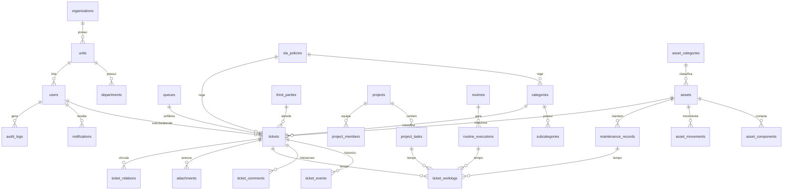

# Modelo de dados — Gestão TI Tia Eliana

Fonte da verdade: [`apps/api/prisma/schema.prisma`](../apps/api/prisma/schema.prisma) (Prisma → PostgreSQL). Nomes de tabela em `snake_case` via `@@map`.

## Diagrama (entidades principais)

## Tabelas

### Estrutura e pessoas
- **organizations** — empresa(s). MVP usa uma (Tia Eliana).
- **units** — Escritório, Indústria, Lojas, Logística…
- **departments** — setores (TI, Comercial, Televendas, Expedição, Fiscal…).
- **users** — perfil único (`role`), `isProtected` para Owner, lockout de login (`failedLogins`, `lockedUntil`). Nunca apagados (soft delete `active`).
- **queues** — filas de atendimento (Suporte N1, Desenvolvimento, Infraestrutura).

### Atendimento
- **categories / subcategories** — catálogo de serviços; categoria carrega `formSchema` (formulário condicional JSON), SLA, fila padrão e template de resposta.
- **sla_policies** — minutos de 1ª resposta/solução por prioridade, modo corrido/comercial, expediente, dias úteis. `holidays` complementa.
- **tickets** — chamado completo: número único, solicitante, unidade/setor, categoria, canal, impacto, urgência, `calculatedPriority` + `priority` validada com justificativa, técnico, fila, ativo/projeto/terceiro relacionados, ticket externo, prazos e carimbos (aberto/triagem/1ª resposta/início/resolvido/fechado), pausa de SLA (`slaPausedAt`, `slaPausedMinutes`), reaberturas, avaliação, formulário respondido, tags, área dona da informação.
- **ticket_events** — histórico imutável (trigger): status, prioridade, atribuição, 1ª resposta, resolução, reabertura, fechamento, cancelamento, vínculo, interrupção, edição.
- **ticket_comments** — públicos e internos (`isInternal`).
- **ticket_watchers**, **ticket_relations** (pai/filho/relacionado/duplicado).
- **ticket_worklogs** — apontamentos de tempo vinculáveis a chamado/tarefa/rotina/manutenção; tipo, início/fim/duração, manual, resultado, próximo passo, edição justificada (editedBy/At/Justification), estorno lógico (`active`). Sem DELETE físico.
- **attachments** — genérico (chamado, comentário, tarefa, ativo, manutenção, movimentação, execução de rotina); nome em disco aleatório.
- **third_parties** — fornecedores/terceiros com contrato, SLA, horários; vínculo de ticket externo fica no chamado.

### Gestão do trabalho
- **projects / project_members / project_tasks** — status próprios, %, horas previstas; horas realizadas derivam dos worklogs das tarefas.
- **routines / routine_executions** — frequência (diária→anual/personalizada), responsável+substituto, checklist JSON, exigência de evidência, tolerância; cada execução é um registro imutável (sem DELETE).

### Inventário
- **asset_categories** — computador, notebook, monitor, impressora, servidor, rede, nobreak, PDV, catraca…
- **assets** — código `ATI-…`, `publicId` (QR), patrimônio físico, classificação (`kind`: ativo individual/componente/consumível/kit + `quantity`/`minStock`), localização, responsáveis, compra/garantia/fornecedor, config técnica (hostname/IP/MAC/SO/`specs` JSON), criticidade, próxima manutenção.
- **asset_components** — memória/SSD/fonte… com instalação/remoção/garantia/custo; histórico preservado.
- **asset_movements** — fluxo Solicitada→Separada→Retirada→Em transporte→Recebida→Confirmada (ou Cancelada/Retornada); origem/destino (unidade, setor, usuário), envolvidos, condição do equipamento. Única forma de mudar a localização de um ativo. Sem DELETE físico.
- **maintenance_records** — tipo, diagnóstico, serviço, responsável/terceiro, duração, peças, custo, resultado, "voltou a operar", próxima preventiva. Sem DELETE físico.

### Transversais
- **notifications** — sino interno; tipos: chamado criado/atribuído/resposta/menção/SLA/reaberto, tarefa, rotina, movimentação, garantia, preventiva.
- **audit_logs** — imutável por trigger; ação, entidade, before/after JSON, justificativa, IP, user-agent, origem.
- **system_settings** — chave/valor JSON (appName, autoCloseHours, wipLimit).
- **counters** — numeração sequencial por escopo/ano com `FOR UPDATE`.

## Índices e integridade

- Índices em status, técnico, solicitante, categoria, unidade, prioridade e datas de abertura dos chamados; ativo+data em movimentos/manutenções; usuário+lida em notificações; entidade+registro e data em auditoria.
- FKs reais em todas as relações; enums nativos do PostgreSQL para status/prioridades/tipos.
- Triggers `forbid_change()` (migration `audit_protection`): UPDATE/DELETE proibidos em `audit_logs` e `ticket_events`; DELETE proibido em `tickets`, `ticket_comments`, `ticket_worklogs`, `asset_movements`, `maintenance_records`, `routine_executions`.
